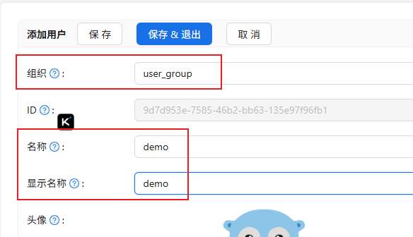

# 登陆配置文档

## 配置页面

### 配置页面访问

访问 http://{COSTRICT_BACKEND}:{PORT_CASDOOR}, 进入管理端登陆页面

```commandline
默认账号： admin
默认密码： 123
```

然后进入到管理页面

## 添加组织

添加的这个组织将会存放所有costrict用户,组织的名称并不重要，可自定义


## 添加应用

这将是CoStrict登录用到的应用,应用名称并不重要，可自定义.


> 客户端ID和客户端密钥对应部署目录`configure.sh`  `OIDC_CLIENT_ID` `OIDC_CLIENT_SECRET`两个变量,如：

```
9e2fc5d4fbcd52ef4f6f
ab5d8ba28b0e6c0d6e971247cdc1deb269c9eea3
```

> 其中 组织是前面新建的组织


重定向url,请修改ip和port,可部署目录`configure.sh` 文件中的 `COSTRICT_BACKEND_BASEURL` 的ip端口一致(注意，根据情况选择使用http/https,完整按照本教程，则是使用http 不要用变量，是真实的ip端口)

```
http://ip:port/oidc-auth/api/v1/plugin/login/callback
http://ip:port/oidc-auth/api/v1/manager/bind/account/callback
htts://ip:port/oidc-auth/api/v1/manager/login/callback
```


> 最后，保存当前应用

## 添加用户

进入组织的用户，然后点击添加


添加demo用户，点击保存&退出。



添加后可以修改密码：


如果你需要批量导入用户，请查看官方教程：[从XLSX文件导入用户](https://www.casdoor.org/zh/docs/user/overview/#%E4%BB%8Exlsx%E6%96%87%E4%BB%B6%E5%AF%BC%E5%85%A5%E7%94%A8%E6%88%B7)

> 配置结束，之后就可以使用demo用户登录costrict了(注意是costrict不是casdoor)，如需更多配置，如：oauth,sms,github等配置，参考：[v4 casdoor配置](./casdoor.md)